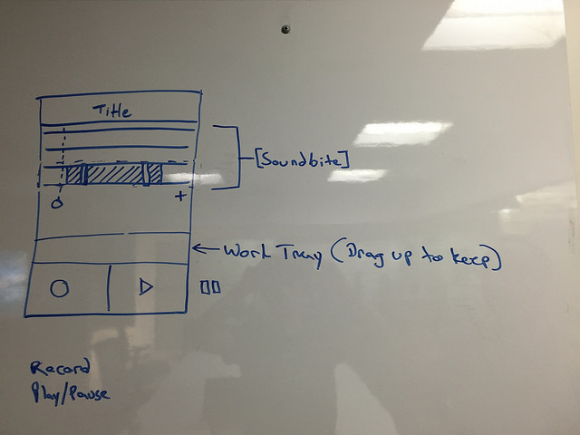

# Soundwich

Soundwich is a sound app. It lets you create short sounds to share.

Time spent: ``

### Features

##### Core
- [ ] Record a sound
- [ ] Basic soundwich sound editor
- [ ] Sound editor: Merge channels/soundbite
- [ ] See a list of your created sounds in a feed
- [ ] Upload to Tumblr
- [ ] CRUD operations for soundwiches

##### Bonus
- [ ] Add Photo
- [ ] Feed autoplays center soundwich
- [ ] Sound editor: Duplicate Channel/soundbite
- [ ] Sound editor: Duplicate Soundwiches
- [ ] Upload to Soundcloud
- [ ] Generate video with waveform
- [ ] Upload to Tumblr
- [ ] Export as a ringtone

#### Wireframes

##### Feed Screen

table view, think Vine.

##### Record Screen

